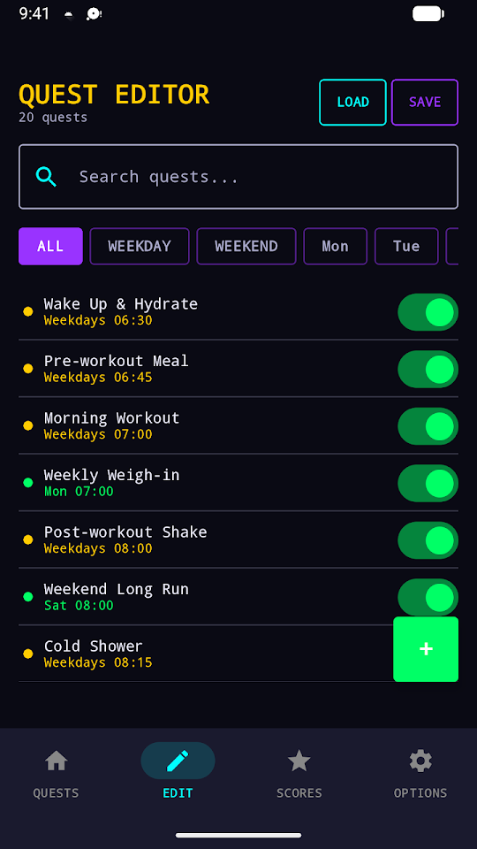
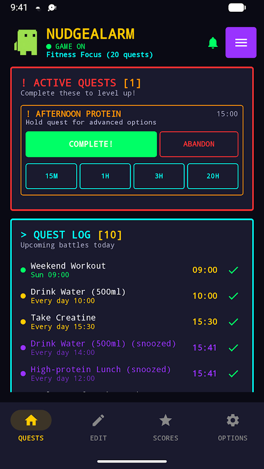
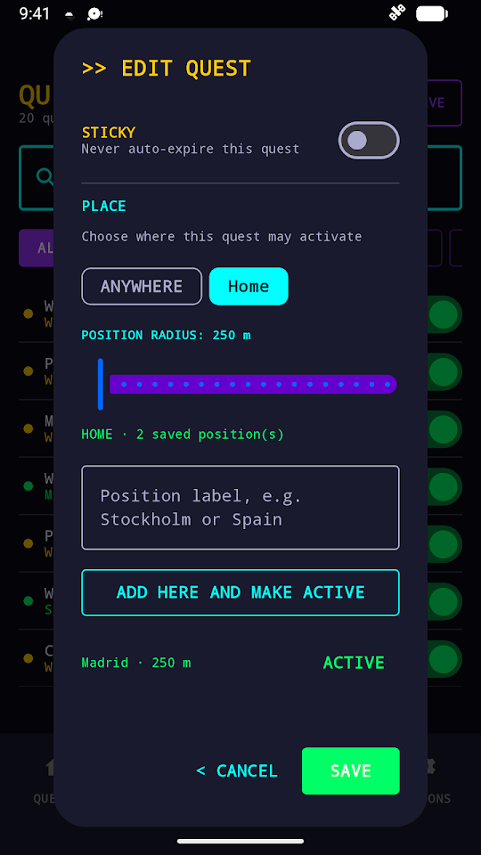
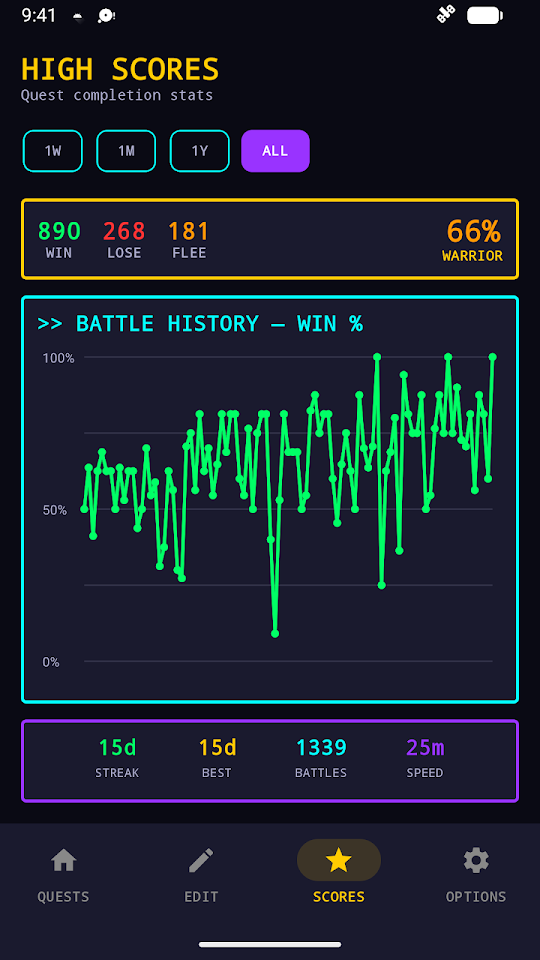
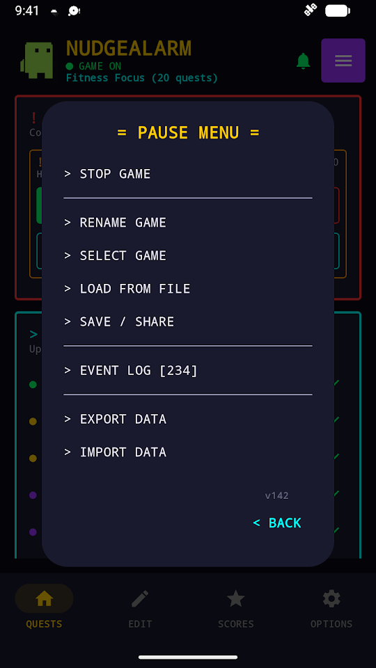
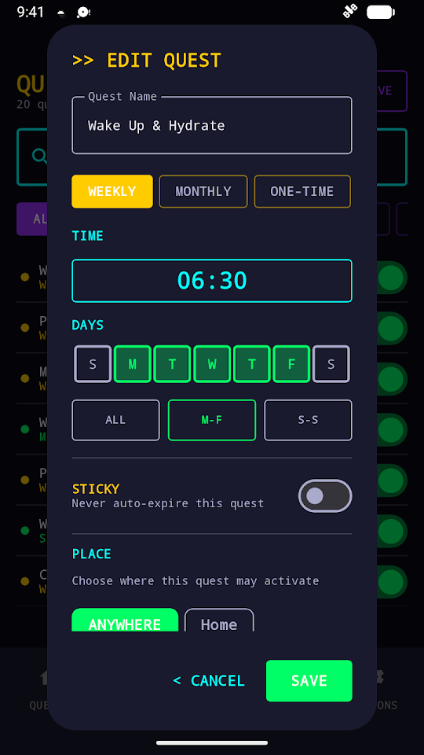
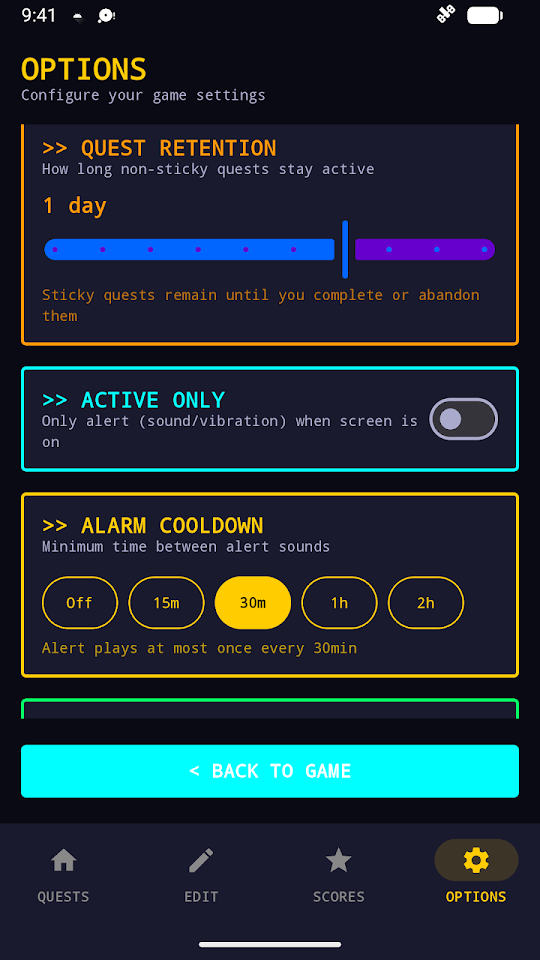
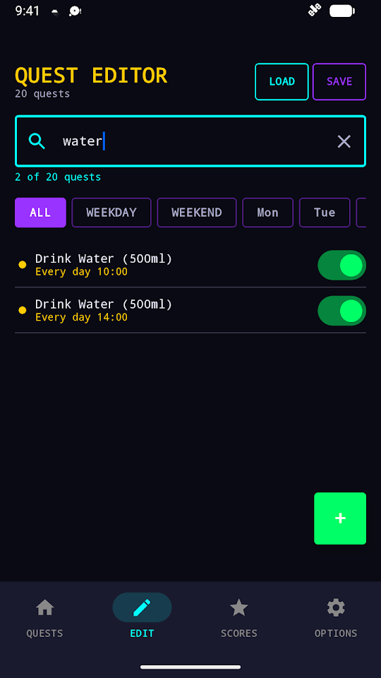

<div align="center">
  
  <h1>NudgeAlarm</h1>
  <p><strong>The free nagging reminder for tasks you cannot afford to forget.</strong></p>
  <p>Get nudged again and again until you complete, snooze or mute the task.</p>

  <p>
    <a href="https://play.google.com/store/apps/details?id=se.joynes.nudgealarm"></a>
  </p>

  <p>
    
    
    
    
  </p>
</div>

NudgeAlarm is an Android nagging reminder app for tasks that are too important for a single notification. Its main job is simple: keep reminding you at the interval you choose instead of assuming that one easily dismissed notification was enough. Turn routines into quests, snooze when life gets in the way, mute them when you need quiet, and complete them when they are actually done.

It is completely free, contains no ads or tracking services, and stores your reminders and history locally on your phone.

## See it in action

<p align="center">
  <a href="NudgeAlarm_GooglePlay_v141_intro.mp4"><strong>▶ Watch the short product walkthrough</strong></a>
</p>

| Organize every quest | Act when it matters | Remind only at the right place | See real progress |
|:---:|:---:|:---:|:---:|
|  |  |  |  |

| Pause without losing your setup | Configure each quest | Tune global behavior | Find quests quickly |
|:---:|:---:|:---:|:---:|
|  |  |  |  |

## Why NudgeAlarm?

Ordinary reminders are easy to dismiss before the job is done. NudgeAlarm separates **being notified** from **finishing the task**:

1. A quest becomes active at its scheduled time.
2. NudgeAlarm repeats the reminder using the interval and limits you selected.
3. You complete it, snooze it, or abandon that attempt.
4. Local statistics show which routines are working over time.

The scheduler checks for due quests about every five minutes. A reminder can therefore arrive a few minutes after its scheduled time rather than exactly on the minute. Android may also delay or stop background work depending on the device and its battery settings, so exact-time delivery cannot be guaranteed.

## Highlights

- **Persistent nagging** — repeat reminders as often as every five minutes and choose the maximum number of nudges.
- **Useful snoozing** — postpone one quest or several active quests at once.
- **Quiet Mode** — temporarily silence alarms without destroying schedules.
- **Place-aware reminders** — optionally show a quest only near a saved place such as Home.
- **Reusable places** — change which physical location counts as Home without relinking every quest.
- **Flexible schedules** — one-time, daily, weekdays, weekends, selected days, monthly, or advanced cron expressions.
- **Per-quest control** — configure sticky behavior, sound, vibration, snooze choices, location and enabled state.
- **Search, filtering and ordering** — quickly find quests and arrange them in a useful order.
- **Templates and save slots** — start quickly and keep separate setups for situations such as Work, Weekend or Travel.
- **Statistics** — review completion rate, streaks, response time and quest history.
- **Direct notification actions** — complete or snooze without opening the app.

## Create quest lists with AI

NudgeAlarm can export only the quests you select as a readable YAML text file. Give that file to the AI tool of your choice to rename, reorder, duplicate or generate reminders, then import the edited file back into NudgeAlarm.

The app does **not** send anything to an AI service itself. You decide what to export and where to share it.

```yaml
reminders:
  - title: "Take an afternoon walk"
    schedule: "0 15 * * 1-5"
    nag_interval: 15
    max_nags: 4
    sticky: false
    enabled: true
    place_id: "home"
```

See [nudgealarm_schema.md](nudgealarm_schema.md) for the supported format.

## Privacy

- No advertising.
- No analytics or tracking SDKs.
- No account required.
- Reminders, saved places, settings and history remain on the device.
- Export happens only when you request it.
- Location access is optional and used only for place-aware quests.

Read the complete [privacy policy](PRIVACY_POLICY.md).

## Install

The easiest option is to [install NudgeAlarm from Google Play](https://play.google.com/store/apps/details?id=se.joynes.nudgealarm). NudgeAlarm requires Android 12 or later.

Notification permission is required to deliver reminders. For the most reliable nagging, keep the persistent **NudgeAlarm Active** notification enabled and set NudgeAlarm to **Unrestricted battery use** (or disable battery optimization for it) in Android. The app shows these recommended settings during setup. Location permission is required only when you enable a place-aware quest.

## Build from source

Requirements:

- Android Studio
- Android SDK 36
- The JDK bundled with Android Studio

```bash
git clone https://github.com/joynes/NudgeAlarm.git
cd NudgeAlarm
export JAVA_HOME="/Applications/Android Studio.app/Contents/jbr/Contents/Home"
./gradlew test
./gradlew assembleDebug
```

Architecture notes are available in [ARCHITECTURE.md](ARCHITECTURE.md). Release and signing details are documented in [upload.md](upload.md).

## Contributing

Bug reports, feature suggestions and pull requests are welcome. Before opening a new report, please check the existing [issues](https://github.com/joynes/NudgeAlarm/issues).

When reporting a reminder problem, include the Android version, device model, NudgeAlarm version, schedule type and what you expected to happen. Do not include private reminder text or precise saved locations unless they are essential to reproduce the issue.

## License

NudgeAlarm is free and open-source software released under the [MIT License](LICENSE).
